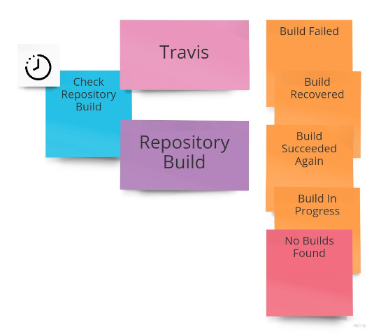
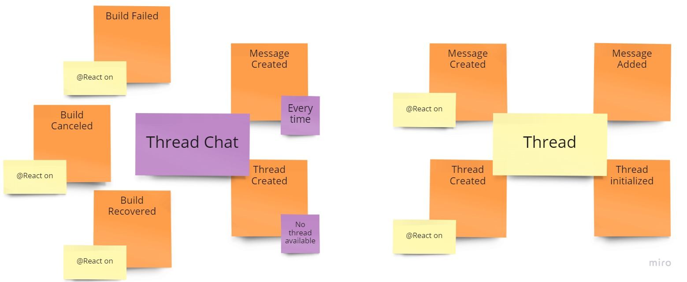

ChatBot EventStorming
-------

The results of the EventStorming session are present below.

The stickies color on the board represents the following:

* orange — an event;
* blue — a system command;
    * with a user — a user command;
    * with a clock — a scheduled command;
* froly (warm red) — a rejection;
* yellow — an aggregate;
* purple — a process;
* green — a projection;
* pink — an external system.

# GitHub Bounded Context

# Google Chat Bounded Context

